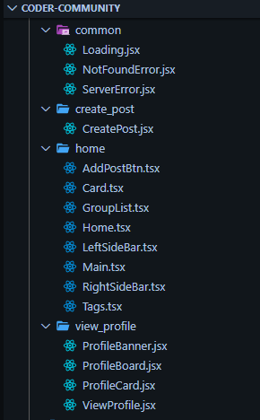
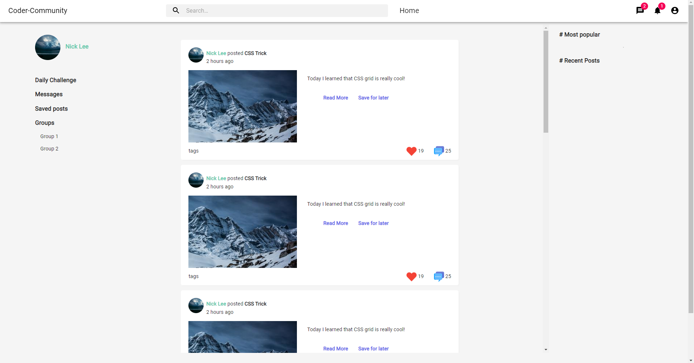
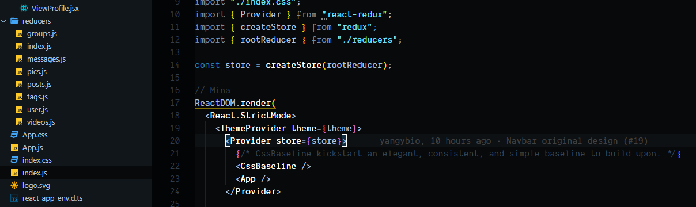
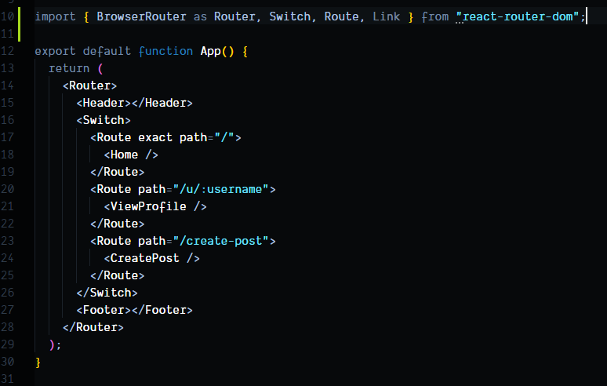
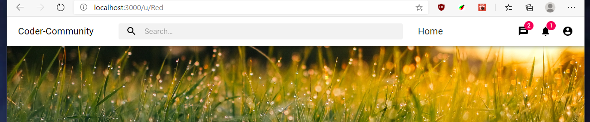
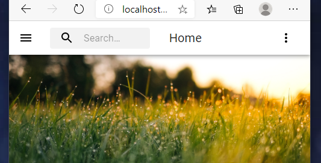
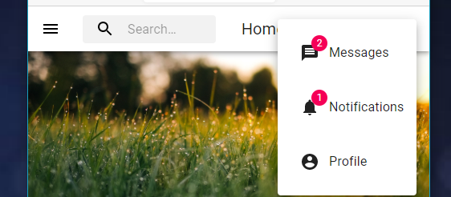

# Project Progress 4

### _Use collections to store your data in MongoDB._

We are storing many collections in MongoDB:

### _Set up Node and Express to connect your React+Redux frontend with your Mongo DB_

### _Ensure that you are now retrieving your data from the database to display in your React components (at least one API)_

We retrieve the following information from various API endpoints:

- User
- Tags
- Posts
- Groups

### _Ensure that you have a type of input or form element that sends data to the database (at least one API)_

- Login (sends GitHub user info to database)
  
  

- Create Post
  

- Create Group
  

### _Implement EITHER update or delete (or both!) for your data in the database._

- Update Post (looks similar to create post)

## Other Accomplishments

- Trending posts infinite scroll. Fetches posts in order of decreasing popularity and freshness, while the user scrolls through the page.

- File upload and static image hosting of user content

- GitHub OAuth login and custom token-based authentication

- Users can create / join / leave groups

- Users can like / unlike posts

## Goals, Regrouped:

### **3-5 minimal requirements**

- Login and authentication system (Done)
- Allow users to upload videos, pics, create, delete, update posts (Mostly Done)
- Create, join and leave groups (Mostly Done)
- Like and unlike posts (Done)

### **3-7 standard requirements**

- View posts by popularity (trending) and by tag (Done)
- Search system (Not done)
- Following/followers system (Some done)
- Comment system (Not done)
- Let user have a "saved posts" reading list (Mostly done)

### **2-3 stretch requirements**

- Real time messaging (Not done)
- Interactive coding tutorial (Not done)

---

---

---

# Project Progress 3

## Completed Tasks:

## Put some default data for your “main” data in your reducer(s).

## Connect the default data to at least one component in order to display it.

It has been connected to the component for the Home (`/`), Post (`/post/<post-id>`), and User (`u/<user-id>`) pages.

### Home:

### Post:

### User:

## Create a minimum of 3 actions that manipulate your store.

These are working on the pages above.

## Additionally, video upload page:

## Back end initial setup / repo structuring for full stack app:

---

---

# Project Progress 2

## Completed Tasks:

### A component structure of the app / at least 5 components:

### A component for the main item (post) and styling / progress towards completing one of our minimal goals:

### Optional: Redux setup

### Additionally: React Router setup

### Responsive Navbar

---

---

# Project: _Coder Community_ (tentative title)

CPSC 436i Summer 2020
Team: Team Red (tentative name)
Members:

- Dara Nguyen x3n1b
- Yang Yang c7x2b
- Zhuoting Xie k6y2b
- John Zou r6m2b

### Description

Targeting programmers or anyone who are interested in programming, **Coder Community** is a social network for programmers to connect with each other, share ideas, write articles.

- It will store user information, Social network (friends/followers), Blogs and associated items (comments, likes, images), video diary items (short videos, images, voice clips).
- Users will be able to:
  - Feel a sense of belonging
  - Self improvement (learning and staying up to date with latest technology)
  - Find friends and project partners
- Additionally, we hope to implement, based on time constraints:
  Real-time messaging, integration with other services such as automatic uploading to Youtube

### Project task requirements:

#### 3-5 minimal requirements (will definitely complete)

- Login and authentication system
- Allows users to upload videos, photos, pics, and create, delete, update posts
- Allows users to comment on other users’ blogs
- Implements server following RESTful principles with basic functions (including GET PUT POST DELETE) being supported.
- Connects to MongoDB and be able to store and retrieve user comments when requested.

#### 3-7 "standard" requirements (will most likely complete)

- Show posts in categories (tags) and popularity
- Create groups which people can join

- Supports user authentication using passport or other packages
- Deploys using heroku or other cloud services

#### 2-3 stretch requirements (plan to complete 1!)

- Allow user to upload interactive coding tutorial
- Real-time messaging (one-on-one and group chat)

### Pick 2 of your minimal requirements and break each of them down into ~2-5 smaller tasks!

#### (1) Create/edit/delete articles

- Create MongoDB schema for articles
- Write back end API service in NodeJS
- Create Web interface for creation/editing/deletion/viewing articles
- Integrate with login / authentication system

#### (2) Login and authentication system

- Create MongoDB schema for users/hashes
- Write back end API service in NodeJS
- Configure NodeJS middleware for authentication
- Create Web interface for login/registration

### More prototypes/sketches

https://www.figma.com/file/ehowTfq9OAMUdMf3Qbngi0/Programmers-Social-Network?node-id=0%3A1

#### Profile

#### Create New Post

#### Post Detail

