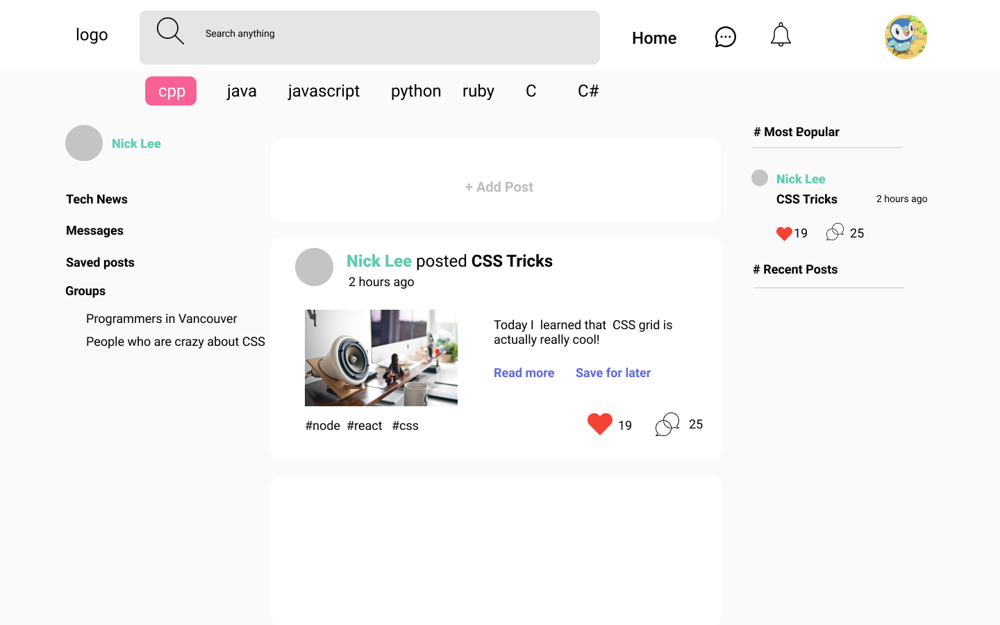

# Project: *Coder Community* (tentative title)

CPSC 436i Summer 2020
Team: Team Red (tentative name)
Members:
- Dara Nguyen x3n1b
- Yang Yang c7x2b
- Zhuoting Xie k6y2b
- John Zou r6m2b

### Description
Targeting programmers or anyone who are interested in programming, **Coder Community** is a social network for programmers to connect with each other, share ideas, write articles.
- It will store user information, Social network (friends/followers), Blogs and associated items (comments, likes, images), video diary items (short videos, images, voice clips).
- Users will be able to:
  - Feel a sense of belonging
  - Self improvement (learning and staying up to date with latest technology)
  - Find friends and project partners
- Additionally, we hope to  implement, based on time constraints:
	Real-time messaging, integration with other services such as automatic uploading to Youtube
  
### Project task requirements:
####	3-5 minimal requirements (will definitely complete)
  - Login and authentication system
  - Allows users to upload videos, photos, pics, and create, delete, update posts
  - Allows users to comment on other users’ blogs
  - Implements server following RESTful principles with basic functions (including GET PUT POST DELETE) being supported.
  - Connects to MongoDB and be able to store and retrieve user comments when requested.
  
#### 3-7 "standard" requirements (will most likely complete)
  - Show posts in categories (tags) and popularity 
  - Create groups which people can join

  - Supports user authentication using passport or other packages
  - Deploys using heroku or other cloud services

#### 2-3 stretch requirements (plan to complete 1!)
  - Allow user to upload interactive coding tutorial
  - Real-time messaging (one-on-one and group chat)
	

### Pick 2 of your minimal requirements and break each of them down into ~2-5 smaller tasks!

#### (1) Create/edit/delete articles
  -	Create MongoDB schema for articles
  -	Write back end API service in NodeJS
  -	Create Web interface for creation/editing/deletion/viewing articles
  -	Integrate with login / authentication system

#### (2) Login and authentication system
  -	Create MongoDB schema for users/hashes
  -	Write back end API service in NodeJS
  -	Configure NodeJS middleware for authentication
  -	Create Web interface for login/registration

### More prototypes/sketches
https://www.figma.com/file/ehowTfq9OAMUdMf3Qbngi0/Programmers-Social-Network?node-id=0%3A1

#### Profile

#### Create New Post

#### Post Detail

